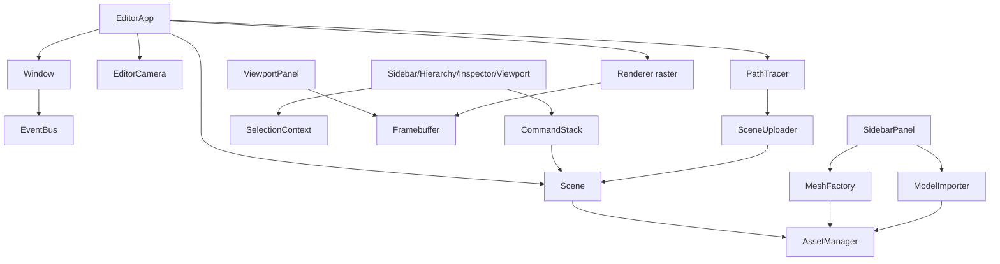

# Forge — Simple 3D Engine & Editor: Architecture Plan

**Status:** Planning / M0 scaffold
**Date:** 2026-06-11
**Target platform:** Windows 11, x64 (portable C++ — Linux later if wanted)

---

## 1. Goals

Build a small but real 3D engine with an integrated editor that can:

1. Place primitive shapes (cube, sphere, plane, cylinder, cone, torus) into a scene.
2. Import free assets from the web (glTF 2.0 and OBJ — the formats CC0 libraries like
   Kenney.nl, PolyHaven, and Sketchfab-CC0 actually ship).
3. Select, move, rotate, and scale objects with on-screen gizmos and an inspector sidebar.
4. Shade the scene: flat → Blinn-Phong → PBR (metallic/roughness), plus a shadow map.
5. Toggle a **ray-traced render mode**: a progressive GPU path tracer implemented as an
   OpenGL compute shader (no Vulkan/DXR complexity, runs on any GL 4.3+ GPU).

**Non-goals (for now):** physics, audio, animation/skinning, scripting, multi-platform
renderers, networking. The architecture leaves seams for them but we do not build them.

---

## 2. Technology choices

| Concern | Choice | Why |
|---|---|---|
| Language | **C++20** | Compiled, the industry standard for engines; GCC 13.2 already installed. |
| Build | **CMake 3.29 + Ninja**, deps via `FetchContent` | Already installed; FetchContent = zero manual dependency installs, fully reproducible. |
| Compiler | **MinGW-w64 GCC 13.2** (present) | Works out of the box; no 8 GB Visual Studio install required. |
| Window/input | **GLFW 3.4** | De-facto standard, tiny, stable. |
| Graphics API | **OpenGL 4.6 core** | Simple to learn/debug, compute shaders for the path tracer, first-class on NVIDIA. |
| GL loader | **GLEW (glew-cmake fork)** | Pure-CMake build, no Python generation step (glad2 needs Python+jinja). |
| UI | **Dear ImGui (docking branch)** | The editor-UI standard; dockable panels give us the sidebar/viewport layout for free. |
| Gizmos | **ImGuizmo** | Translate/rotate/scale manipulators that plug straight into ImGui. |
| Math | **GLM** | GLSL-style vectors/matrices, header-only. |
| Asset import | **tinygltf** + **tinyobjloader** | Header-only, cover the two formats free-asset sites use. Heavy `assimp` avoided. |
| Images | **stb_image** | Header-only PNG/JPG/HDR. |
| Scene files | **nlohmann/json** | Save/load scenes as readable JSON. |

> **Why not Vulkan/DXR for ray tracing?** A DXR/VK-RT backend is weeks of plumbing before
> the first triangle. A GL compute-shader path tracer is ~600 lines of GLSL, teaches the
> same concepts (BVH, BRDF sampling, accumulation), and runs everywhere. If we outgrow it,
> the `RayTracer` module is isolated behind one interface and can be swapped.

---

## 3. Module / layer structure

Strict downward dependencies — a layer may only include layers above it in this list:

```
┌──────────────────────────────────────────────────────┐
│  editor/        ForgeEditor executable                │
│   EditorApp, Panels, EditorCamera, CommandStack       │
├──────────────────────────────────────────────────────┤
│  engine/scene/      Scene, Entity, Components         │
│  engine/assets/     AssetManager, importers, factories│
│  engine/raytrace/   PathTracer (compute)              │
├──────────────────────────────────────────────────────┤
│  engine/renderer/   Renderer, Shader, Mesh, Texture,  │
│                     Framebuffer, Material, DebugDraw  │
├──────────────────────────────────────────────────────┤
│  engine/platform/   Window (GLFW), Input, GLContext   │
├──────────────────────────────────────────────────────┤
│  engine/core/       Log, Assert, Time, UUID, Events,  │
│                     Math aliases (glm)                │
└──────────────────────────────────────────────────────┘
```

### 3.1 `engine/core`
- `Log` — leveled logging macros (`FORGE_INFO/WARN/ERROR`), printf-style, stdout + ring buffer for an editor console panel later.
- `Assert` — `FORGE_ASSERT(cond, msg)`, breaks in debug.
- `Time` — frame delta, total time.
- `UUID` — 64-bit ids for entities/assets (random, not crypto).
- `Events` — small `EventBus` (subscribe/emit) for window resize, key, mouse; avoids GLFW callbacks leaking everywhere.
- `Math.h` — `using vec3 = glm::vec3;` etc., plus `Ray`, `AABB`, ray-AABB and ray-triangle intersection helpers (used by both picking and the CPU BVH builder).

### 3.2 `engine/platform`
- `Window` — owns `GLFWwindow*`, creates GL 4.6 core context, vsync toggle, pumps events into the `EventBus`. Hides all GLFW types from the rest of the engine.
- `Input` — polled keyboard/mouse state (`Input::IsKeyDown`, `Input::MouseDelta()`).

### 3.3 `engine/renderer` (rasterizer)
- `Shader` — compile/link GLSL from file, uniform cache, hot-reload on key press.
- `VertexBuffer / IndexBuffer / VertexArray` — thin RAII GL wrappers with a `BufferLayout` description.
- `Mesh` — CPU vertex/index data (`pos, normal, uv, tangent`) + the GL objects; keeps CPU copy because the ray tracer and the picker need triangles.
- `Texture2D` — from file (stb) or empty (render targets, accumulation buffer).
- `Framebuffer` — color (+entity-id attachment for pixel-perfect picking later) + depth; resizable. The viewport panel displays its color texture.
- `Material` — shading model enum (`Flat | BlinnPhong | PBR`), albedo/metallic/roughness/emissive params + optional textures.
- `Renderer` — the only class that issues draw calls. API:
  ```
  Renderer::BeginScene(camera, lights);   // upload per-frame UBO
  Renderer::Submit(mesh, material, transform);
  Renderer::EndScene();                   // sort, draw, grid, debug lines
  ```
- `DebugDraw` — immediate-mode lines: infinite grid, AABBs, light icons.

### 3.4 `engine/scene`
Simple **registry-style ECS-lite** (a `std::unordered_map<UUID, ComponentStorage>` per
component type — not archetype-packed; scenes here are hundreds of objects, not millions).

- `Entity` — `{UUID, Scene*}` handle with `Get/Add/Has<Component>()`.
- Components (plain structs, no behavior):
  - `NameComponent { std::string }`
  - `TransformComponent { vec3 translation, rotation(euler), scale; mat4 World() }`
  - `MeshComponent { AssetHandle<Mesh> }`
  - `MaterialComponent { Material }`
  - `LightComponent { Directional | Point; color, intensity }`
  - `CameraComponent { fov, near, far }` (for game cameras later; the editor has its own)
- `Scene` — create/destroy/duplicate entities, iterate by component type,
  `Raycast(ray) -> Entity` (brute-force AABB then triangle test — fine at this scale),
  JSON serialize/deserialize.

### 3.5 `engine/assets`
- `AssetManager` — cache keyed by normalized path → `shared_ptr`; one source of truth so importing the same model twice reuses GPU buffers.
- `MeshFactory` — procedural primitives: `Cube() Sphere(rings,sectors) Plane() Cylinder() Cone() Torus()` with correct normals/UVs.
- `ModelImporter` — `LoadGLTF(path)`, `LoadOBJ(path)` → list of `(Mesh, Material)`; spawns one entity per sub-mesh under a common parent name.
- `TextureImporter` — stb wrapper, sRGB vs linear handling.

### 3.6 `engine/raytrace`
- `SceneUploader` — flattens the scene: every `MeshComponent` instance → world-space triangle soup; builds a **BVH on CPU** (binned SAH, ~200 lines); uploads triangles, BVH nodes, materials, lights into SSBOs. Rebuild only when the scene is dirty.
- `PathTracer` — owns the compute shader (`pathtrace.comp`) and an RGBA32F accumulation texture.
  - Progressive: 1 sample per pixel per frame, accumulated; any camera/scene change resets the accumulation counter.
  - v1 features: BVH traversal, lambertian + metallic BRDF, emissive lights + sky, hard shadows via shadow rays, tonemap in a final blit.
- Editor toggles between `Renderer` (raster) and `PathTracer` output textures — same viewport panel, one enum.

### 3.7 `editor/` (the application)
- `EditorApp` — owns everything, runs the main loop (see §4).
- `EditorCamera` — orbit (LMB-alt / MMB), pan, scroll zoom; produces view/proj for both render paths.
- `CommandStack` — undo/redo. Every mutation goes through a `Command` (`AddEntity`, `DeleteEntity`, `TransformChange`, `MaterialChange`). Ctrl+Z/Ctrl+Y.
- `SelectionContext` — currently selected entity, shared by all panels.
- Panels (each a class with `OnImGuiRender()`):
  - **ViewportPanel** — draws the active render-path texture; hosts ImGuizmo (W/E/R = translate/rotate/scale); click → `Scene::Raycast` → select.
  - **SidebarPanel** (the toolbox the user asked for):
    - *Create*: buttons for each primitive (spawns at camera focus point), "Import model…" (file dialog → `ModelImporter`).
    - *Render*: shading mode (Flat / Blinn-Phong / PBR), **Ray Tracing on/off**, samples-per-pixel counter, max bounces slider.
    - *Environment*: sky color, sun direction/intensity.
  - **HierarchyPanel** — entity list, click to select, right-click delete/duplicate/rename.
  - **InspectorPanel** — components of selected entity: transform drag-floats, material color pickers/sliders, light params.

---

## 4. Runtime flow

### 4.1 Frame loop

```
EditorApp::Run():
  while (!window.ShouldClose()):
    Time::Tick(); window.PollEvents()
    EditorCamera.Update(input)                  // orbit/pan/zoom
    if (mode == Raster):
        framebuffer.Bind()
        Renderer::BeginScene(editorCamera, scene.Lights())
        for e in scene.View<Mesh,Material,Transform>(): Renderer::Submit(...)
        Renderer::EndScene()                    // + grid + selection outline
        framebuffer.Unbind()
    else: // RayTraced
        if (scene.Dirty()) sceneUploader.Rebuild(scene)
        pathTracer.Dispatch(editorCamera)       // +1 spp, accumulate
    ImGui::NewFrame()
      DockSpace(); Sidebar; Hierarchy; Inspector
      Viewport.Draw(activeTexture)              // also: gizmo, picking
    ImGui::Render()
    window.SwapBuffers()
```

### 4.2 Interaction sequence — "user places and rotates a cube"

```
Sidebar "Cube" click
  → CommandStack.Execute(AddEntityCommand(MeshFactory::Cube()))
  → Scene creates entity {Name, Transform, Mesh, Material}
  → SelectionContext = new entity, scene marked dirty
Viewport: user presses E (rotate), drags ImGuizmo ring
  → gizmo edits TransformComponent each frame
  → on mouse release: CommandStack.Push(TransformChangeCommand(before, after))
  → scene dirty → next frame Renderer draws new pose; if RT mode, accumulation resets
Ctrl+Z → CommandStack undoes the transform (or the add)
```

### 4.3 Class interaction diagram



---

## 5. Repository layout

```
3d-engine/
├── CMakeLists.txt              # root: options, FetchContent deps
├── CMakePresets.json           # mingw-debug / mingw-release
├── run.ps1                     # configure+build+launch one-liner
├── docs/PLAN.md                # this file
├── engine/
│   ├── CMakeLists.txt          # static lib `forge`
│   └── src/forge/
│       ├── core/        Log.h Assert.h Time.h UUID.h Events.h Math.h
│       ├── platform/    Window.{h,cpp} Input.{h,cpp}
│       ├── renderer/    Shader Buffer Mesh Texture Framebuffer Material Renderer DebugDraw
│       ├── scene/       Scene Entity Components SceneSerializer
│       ├── assets/      AssetManager MeshFactory ModelImporter TextureImporter
│       └── raytrace/    PathTracer SceneUploader BVH
├── editor/
│   ├── CMakeLists.txt          # exe `ForgeEditor`, links `forge`
│   └── src/
│       ├── main.cpp EditorApp.{h,cpp} EditorCamera.{h,cpp}
│       ├── CommandStack.{h,cpp}
│       └── panels/      ViewportPanel SidebarPanel HierarchyPanel InspectorPanel
└── assets/
    ├── shaders/         pbr.glsl blinnphong.glsl flat.glsl grid.glsl pathtrace.comp tonemap.glsl
    └── models/          (imported free assets live here)
```

---

## 6. Milestones

| # | Deliverable | Acceptance test |
|---|---|---|
| **M0** | Toolchain + deps + window + ImGui dockspace | `run.ps1` opens a dockable dark window at 60 fps |
| **M1** | Renderer core | Blinn-Phong lit cube on an infinite grid, orbit camera |
| **M2** | Scene + editor interaction | Place primitives from sidebar, select by click, gizmo move/rotate/scale, inspector edits, undo/redo |
| **M3** | Asset import | Drag a Kenney/PolyHaven glTF into the scene, textures correct |
| **M4** | Shading upgrades | PBR metallic/roughness + one directional shadow map |
| **M5** | Ray tracing | Sidebar toggle → progressive path-traced viewport, converges noise-free on a still camera within seconds |
| **M6** | Persistence & polish | Scene save/load (JSON), duplicate/delete, console panel |

Each milestone compiles, runs, and is usable on its own — no "big bang" integration.

---

## 7. How to build & launch

```powershell
# one-time + every build (FetchContent downloads deps on first configure)
cmake --preset mingw-release
cmake --build --preset mingw-release
.\build\release\editor\ForgeEditor.exe

# or simply
.\run.ps1            # debug:  .\run.ps1 -Config debug
```

Requirements already on this machine: GCC 13.2 (MinGW-w64), CMake 3.29, Ninja 1.12, Git.
Everything else is fetched and built automatically at configure time.

---

## 8. Risks & mitigations

| Risk | Mitigation |
|---|---|
| GLEW init on core profile | `glewExperimental = GL_TRUE` before `glewInit()` (known requirement). |
| ImGui docking branch API churn | Pin exact commit/tag in FetchContent. |
| Path-tracer perf on big imports | BVH (SAH) + triangle count display; cap scene at ~1M tris for v1. |
| MinGW-built binaries + GPU drivers | OpenGL is driver-provided (`opengl32.dll` ICD) — compiler-agnostic, no issue on NVIDIA. |
| File dialog on Win32 | Use native `GetOpenFileNameW` behind one small wrapper (no extra dep). |
