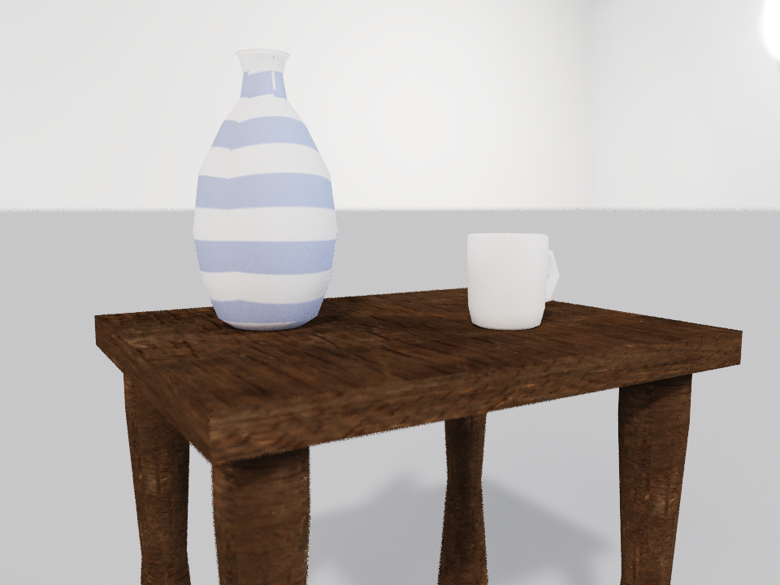
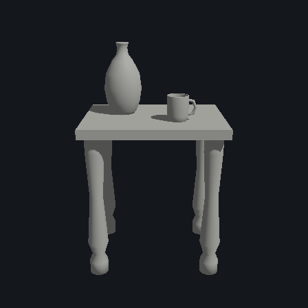
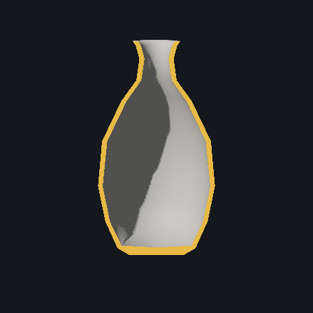

# Milestone 1 — Realistic props: cup, vase, table

**Gate:** one path-traced scene — glazed ceramic cup, patterned vase, wooden
table — that reads as a photo at first glance, built and verified by the agent
through the MCP surface. Scene: [`assets/scenes/milestone1-props.forge`](../../assets/scenes/milestone1-props.forge).

## How it was built (one Lua script per stage, no manual editing)

- **Geometry** — every piece a surface of revolution or a sweep (#111): four
  turned legs + top (table, h = 1.20), thin-walled cup (wall ≈ 0.010) with an
  octagonal-section swept handle, walled vase (belly + neck + flared mouth,
  wall ≈ 0.012). All five meshes watertight, 0 non-manifold edges, 0
  degenerate triangles at spawn.
- **Materials** — Poly Haven `fine_grained_wood` diffuse + roughness on the
  table (#84, #113) over xatlas UVs (#81); cobalt band procedural stripes on
  the vase (#113); glossy porcelain glaze with subsurface scattering on cup
  and vase (#112: random-walk SSS, radius ≈ 0.012 world units at this scale).
- **Lighting** — `studio_small_09` HDRI environment (#84) + warm sun key.
- **Camera** — 3/4 product shot (focal {-0.03, 1.27, 0.02}, distance 1.5,
  pitch 7°, yaw 31°), thin-lens DoF at aperture 0.0065 / focus 1.5, rendered
  960×720 at 4096 spp / 8 bounces via `render_image` overrides (the saved
  scene's rt block keeps editor pinhole defaults).

## Agent verification (the #114 thesis: numbers over eyeballs)

| Check | Result |
|---|---|
| Clay turntable (4 views) | no floating parts, contacts clean |
| Top ortho | plan spacing correct, no overlap |
| Normals view | no inverted-face color flips |
| Object id | all 8 blobs named via legend |
| `mesh_stats` all meshes | watertight, 0 non-manifold, 0 degenerate |
| Tabletop surface height | 1.200 (legs 0 → 1.13, top 0.07) |
| Cup h/w ratio | 0.193 / 0.168 = 1.15 (mug proportions) |
| Vase h/w ratio | 0.560 / 0.300 = 1.87 (bellied vase) |
| Cup / vase contact with tabletop | both within 5e-5 world units |
| Handle attached (overlap with cup wall) | true |
| Cup–vase interpenetration | none |
| Section view through vase | uniform thin wall, hollow interior, solid base |

 

## Reproducing on another machine

The scene's texture and HDRI sources are machine-local paths into the Poly
Haven cache (`%LOCALAPPDATA%/Forge/assets/polyhaven`); a fresh checkout loads
the geometry/materials but warns and renders untextured under no sky. Re-fetch
`fine_grained_wood` (2k, diffuse+rough → apply to the five table entities via
`set_texture`) and `studio_small_09` (2k HDRI, auto-applies) with the
`download_polyhaven_asset` tool, then re-render with the camera/DoF settings
above.

## Honest limits (feed into the next lane)

- The vase "pattern" is procedural bands: stripes land per-UV-chart, so only
  the camera-facing chart shows continuous banding — #129 (texture painting)
  is the real fix for florals and chart-independent patterns.
- Depth-of-field noise outlives the à-trous denoiser (it fades out by design
  as spp grows); crisp DoF needs either more spp than the 4096 cap or a
  DoF-aware filter.
- The backdrop is the HDRI + studio floor — believable for a product shot,
  but a modeled room (Lane 2) would ground wider framings.
